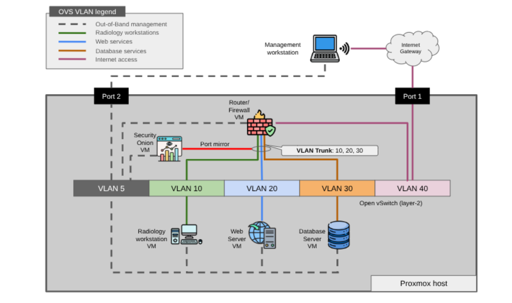
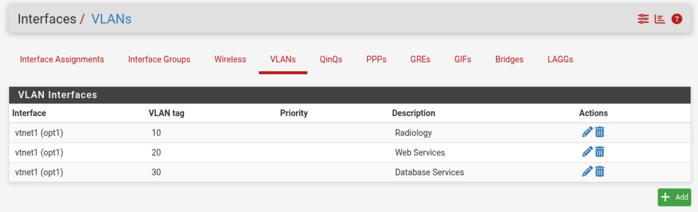
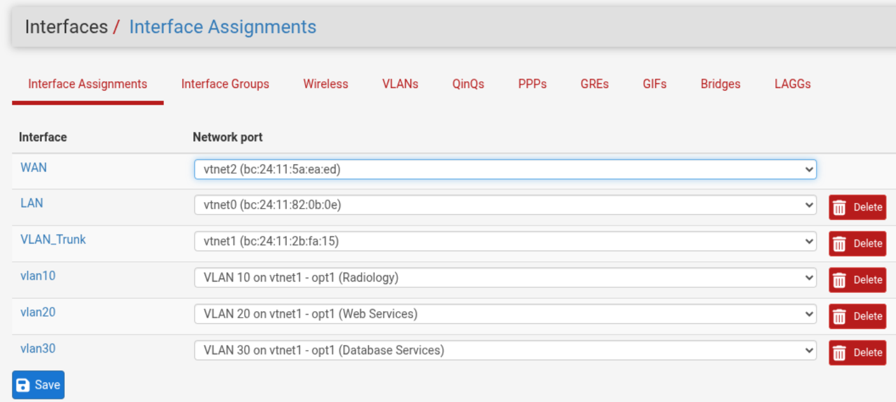

# Cyber Lab
The best way to learn about cyber security and networking is to play with it, and in order to play with it, you need a lab. This project will help you build that lab. It will allow you to have the following components, all in a single physical node.

- Open vSwitch (OVS) is software defined layer-2 switch, with VLAN support.
- Virtualized router/firewall with pfSense
- Virtualized Radiology workstation 
- Virtualized Web server
- Virtualized Database server
- Security Onion virtual appliance (IDS, ELK stack, OSquery, etc.)

Each endpoint is on its own VLAN and IP network, while the router will route traffic between the networks, serve DNS and DHCP, and secure the traffic via the firewall features.

## Table of Contents
- [Hardware requirements](#hardware-requirements)
- [Cyber lab architecture](#cyber-lab-architecture)
- [Configure your workstation](#configure-your-workstation)
- [Proxmox installation](#proxmox-installation)
  - [Disable Proxmox Enterprise repository](#disable-proxmox-enterprise-repository)
- [Open vSwitch](#open-vswitch)
  - [Add Open vSwitch](#add-open-vswitch)
  - [Configuring Open vSwitch](#configuring-open-vswitch)
- [Router / firewall](#router--firewall)
  - [Install pfSense](#install-pfsense)
  - [Start pfSense](#start-pfsense)
  - [Configure pfSense](#configure-pfsense)
  - [Add the pfSense trunk interface](#add-the-pfsense-trunk-interface)
  - [Enable DHCP for client workstations](#enable-dhcp-for-client-workstations)
  - [Enable DNS](#enable-dns)
  - [Open firewall to allow traffic](#open-firewall-to-allow-traffic)
- [Server and workstation installation](#server-and-workstation-installation)
  - [Server and workstation interface VLANs and IP configuration](#server-and-workstation-interface-vlans-and-ip-configuration)
  - [Start the server or workstation VM](#start-the-server-or-workstation-vm)
  - [Enable SSH](#enable-ssh)
- [Database server](#database-server)
  - [Prerequisite](#prerequisite)
  - [Create the database](#create-the-database)
  - [Create database schema](#create-database-schema)
  - [Seed a single patient record](#seed-a-single-patient-record)
  - [Seed 1000 sample patients](#seed-1000-sample-patients)
- [Web server](#web-server)
  - [Prerequisite](#prerequisite-1)
  - [Install the Patient Records Viewer webapp](#install-the-patient-records-viewer-webapp)
  - [Configure the Patient Records Viewer webapp](#configure-the-patient-records-viewer-webapp)
  - [Start the Patient Records Viewer webapp](#start-the-patient-records-viewer-webapp)
  - [Running the web app as a System Service](#running-the-web-app-as-a-system-service)
- [Radiology workstation](#radiology-workstation)
  - [Prerequisite](#prerequisite-2)
  - [Viewing patient records](#viewing-patient-records)
- [Shutting down the lab](#shutting-down-the-lab)
  - [Shut down the workstation and servers](#shut-down-the-workstation-and-servers)
  - [Shut down the router](#shut-down-the-router)
  - [Shut down the hypervisor](#shut-down-the-hypervisor)
- [Starting up the lab](#starting-up-the-lab)
  - [Start the router](#start-the-router)
  - [Start the workstation and servers](#start-the-workstation-and-servers)

## Hardware requirements
This lab was built on a single bare-metal server with the following resources:

- 20 core Intel processor
- 32 GB of memory
- 512 GB of storage
- Dual network interfaces

The second network interface is not a requirement. In this lab, we'll use NIC 1 for Internet access and NIC 2 for an OOB (out-of-band) management network. The OOB network is not required, but good to have so that you can always reach each device, even if traffic in the virtual network is disrupted.

During initial configuration of the bare-metal host, you'll also want the following:

- External monitor with the correct cable (DVI, HDMI, etc.)
- Wireless keyboard and mouse. Just plug in the USB connector to one of the ports.

## Cyber lab architecture



## Configure your workstation
Before you get started, you'll want to cable up the network as shown in the diagram.
- Connect a USB-to-Ethernet adapter to your laptop
- Connect an Ethernet cable from your adapter to port 2 of the bare-metal host
- In the network settings of your laptop, configure the new wired Ethernet port with the IP address of `192.168.5.99/24`. You do not need to configure a gateway or DNS server on this interface.
- Connect an Ethernet cable from port 1 of the bare-metal host to the local network of the facility you are in (ie. local Wi-Fi router)

## Proxmox installation
1. [Download](https://www.proxmox.com/en/downloads/proxmox-virtual-environment/iso) the **Proxmox VE 9.2 ISO Installer** image (ie. `proxmox-ve_9.2-1.iso`)
2. [Copy it to a bootable thumb drive](https://pve.proxmox.com/pve-docs/chapter-pve-installation.html#_instructions_for_windows)
3. Boot the server to that drive to [install](https://pve.proxmox.com/pve-docs/chapter-pve-installation.html) Proxmox as the hypervisor
   - Configure NIC 1 as your Interface facing port, and set it to use DHCP to acquire it's IP configuration from your Wi-fi router.
   - From the Proxmox host's console, you can find the IP address assigned to it with the command `ip a`
5. [Log in](https://pve.proxmox.com/pve-docs/chapter-pve-installation.html#_instructions_for_windows) to the Proxmox management interface


### Disable Proxmox Enterprise repository
1. Select the Proxmox host (ie. cyberlab)
2. In the **Updates** menu, select **Repositories**
3. Select the respository `https://enterprise.proxmox.com/debian/pve`
4. Click on **Disable**
5. Click **Add** and select the **No-Subscription** repository from the dropdown menu, then click **Add** again
6. Select the respository `https://enterprise.proxmox.com/debian/ceph-squid`
7. Click on **Disable**
8. Click **Add** and select the **Ceph Squid No-Subscription** repository from the dropdown menu, then click **Add** again

## Open vSwitch
By default, Proxmox will use Linux bridge for networking. This section will help you install and configure Open vSwitch, which is needed for more advanced networking features, such as port mirroring.

### Add Open vSwitch
Install openvswitch on the Proxmox host.

1. Right-click on the Proxmox host
2. Select **Shell**

```
apt update
apt install openvswitch-switch
```
### Configuring Open vSwitch
Switching from Linux bridge to Open vSwitch must be done carefully so you don't lose network connectivity during the process. The high level process is as follows:

1. Create a new **OVS Bridge** (ie. `ovsbr0`)
2. Create a new **OVS IntPort** on the OVS bridge. Give it an IP address and mask (ie. `192.168.5.5/24`) and use **VLAN Tag** (ie. `5`). 
3. Add the same **VLAN Tag** to a physical interface (ie. `nic1`) to add the interface to the VLAN

You should now be able to connect to that interface, so you can complete the rest of the OVS configuration.

Create another **OVS IntPort** for VLAN 40. You don't need to add an IP address and mask to it, so that it obtains its address via DHCP. Add the other interface (ie. `nic0`) to VLAN 40.

Be sure to click **Apply Configuration** when done making your chagnes in the UI.


Alternately, you can get to this point by setting your `/etc/network/interfaces` file with the content in the example [interfaces file](assets/ovs-config.txt)
```
# Reload Proxmox network config after changing interfaces file
ifreload -a
```
## Router / firewall
This lab uses pfSense as a router and firewall. It will have the following three interfaces.

1. **Management**: Interface on the OOB management network, VLAN 5
2. **VLAN Trunk**: Trunk (VLAN tagged) interface on VLANs 10, 20 and 30
3. **Internet**: Internet-facing interface, VLAN 40

### Install pfSense

1. [Download](https://www.pfsense.org/download/) the pfSense image.
2. Upload the image to Proxmox (Datacenter --> host --> local --> ISO images)
3. In the Proxmox console, click **Create VM**
4. **General** tab, enter a name (ie. `router-firewall`), click **Next**
5. **OS** tab, select the pfSense image (ie. `netgate-installer...`), click **Next**
6. **System** tab, click **Next**
7. **Disks** tab, change the disk size to 16 GiB, click **Next**
8. **CPU** tab, change the cores to 2, click **Next**
9. **Memory** tab, change the memory to 4096 MiB, click **Next**
10. **Network** tab, uncheck the firewall box, click **Next** (we'll configure networking later)
11. **Confirm** tab, make sure the 'Start after create' checkbox is __unchecked__, click **Finish**

Now configure the networking interfaces 

1. Click on the new VM, then click on **Hardware**
2. Double-click the one network device listed. Make sure 'Firewall' is unchecked. In the **VLAN Tag** box, enter `5`, for the OOB management VLAN
3. Click **Add** --> **Network Device**. Make sure 'Firewall' is unchecked. Leave the **VLAN Tag** box empty. We'll configure all the VLANs in this trunk interface on the router
4. Click **Add** --> **Network Device**. Make sure 'Firewall' is unchecked. In the **VLAN Tag** box, enter `40`, for the Internet-facing VLAN

### Start pfSense

1. Click the **Start** button at the top of the screen
2. Click on **Console** so you can see the VM boot and enter the configuration menu
3. Click **Accept** 
4. Click **Install**
5. Click **OK**
6. Select your WAN interface. This is the Internet-facing interface of the router. You can click back to the **Hardware** page to see the MAC address of the interface in VLAN 40, then select that interface back in the console. If your Internet interface will use DHCP to get an address, leave it at the default. Otherwise set the static IP information as needed. This is not a trunk interface, so leave VLAN tagging disabled.
7. Select your LAN interface. This is the OOB management interface of the router. Set the static IP address and mask (ie. `192.168.5.1/24`). Make sure DHCP is disabled.
8. Confirm the LAN and WAN interfaces and **Continue**. It will need Internet connectivity over the WAN interface.
9. Select **Install CE**
10. Select **Continue** at the screen for filesystem type and partitions, then select **OK**, then **OK**
11. For the 'Version of pfSense CE to install', select the **Current stable version**, click **OK**
12. Click **OK** when the installation is complete, then select **Reboot**
13. Select `3` to reset the admin account and set the password

### Configure pfSense

You should now be able to access the pfSense GUI by pointing your browser to the LAN interface IP from a computer with access to the VLAN 5 network.

- **URL**: https://<lan_interface_ip>  (ie. https://192.168.5.1)
- **Login**: `admin`
- **Password**: the password you set in step 13 above

Run through the initial configuration wizard:

- **Hostname**: pfsense (or some other name of your choosing, such as `router`, `firewall`, `router-firewall`)
- **Domain**: cyberlab.com
- Leave DNS configurations as is
- **Time server hostname**: leave at default or use `north-america.pool.ntp.org`
- **Timezone**: Set to your timezone (ie. `America/New_York`)
- **WAN Interface**: leave default of using DHCP and click Next
- **LAN Interface**: lIt should already be set to what you configured during installation (ie. `192.168.5.1/24`). Click Next
- **Admin Password**: You did this in step 14 above. Click next.
- Click **Reload**, then click **Finish**

You should now see the Dashboard.

### Add the pfSense trunk interface
Configure the networking device on the pfSense that will be used as the VLAN Trunk.

1. In the pfSense GUI, go to Interfaces --> Interface Assignments
2. With the available Network port selected, click **add**
3. Click on the name of the new interface (ie. OPT1)
4. Change the description (name) of the interface to `VLAN_Trunk`
5. Enable the interface by checking the box
6. Click **Save** at the bottom of the screen, then **Apply Changes**

Now add the VLANs to the interface.

1. Go to Interfaces --> Interface Assignments -- VLANs
2. Click **Add**
3. Select the VLAN_Trunk interface (it may still show with the 'opt1' name)
4. Enter the VLAN tag `10`
5. For Description, enter `Radiology`
6. Repeat steps 2-5 so you end up with the following three VLANs



Create VLAN interfaces and add IP configuration.

1. Go to Interfaces --> Interface Assignments
2. Click **Add** to add an interface for each VLAN
3. For each one, click on the name, set the description (ie. `vlan10`), static IPv4 configuration and enable the interface. You should have the following interfaces when done.

| Interface  | Static IP       | Description         |
|------------|-----------------|---------------------|
| vlan10     | 192.168.10.1/24 | Radiology           |
| vlan20     | 192.168.20.1/24 | Web Services        |
| vlan30     | 192.168.30.1/24 | Database Services   |



You can now go to the **Status** --> **Interfaces** page to see the status of all the physical and VLAN interfaces. They should all show a status of `up` with their appropriate static IPv4 address configuration.

### Enable DHCP for client workstations
Client workstations, such as the Radiology workstation, does not require a static IP address because nobody will be connecting to it. This is unlike the web server, database server and gateway IP addresses. In this section, we configure a DHCP server on VLAN 10 of the router.

1. Go to **Services** --> **DHCP Server**
2. Select the VLAN 10 interface
   - Check the box to enable DHCP server on the VLAN 10 interface
   - **Address Pool Range**: 192.168.10.110 - 192.168.10.119
   - **DNS Servers**: 192.168.10.1
   - **Gateway**: 192.168.10.1
3. Click **Save** at the bottom
3. Click **Apply Changes** at the top

### Enable DNS
For nodes, such as the workstations, web servers and database servers to communicate with each other, they will either need the IP address of the node they want to communicate with or their FQDN (fully qualified domain name). They are are using the FQDN, then there will need to be a DNS server that can resolve the FQDN-to-IP mapping. 

1. In pfSense, go to **Services** --> **DNS Resolver**
   - **Enable DNS resolver** box is checked
   - **Network Interfaces**: All
   - **DHCP Registration**: Check this box (DHCP client names will be added)
3. In the **Host Overrides** section, click **Add**
   - **Host**: webserver
   - **Domain**: cyberlab.com
   - **IP Address**: 192.168.20.120
   - **Description**: Web server
   - In the **Additional Names for this Host** section add an additional name
   - **Host name**: patients
   - **Domain**: cyberlab.com
   - **Description**: Patient records app
   - Click **Save**
4.  In the **Host Overrides** section, click **Add**
   - **Host**: database
   - **Domain**: cyberlab.com
   - **IP Address**: 192.168.30.130
   - **Description**: Database server
   - Click **Save**
5. Click the **Save** button just above the **Host Overrides** section
6. Click **Apply Changes**

### Open firewall to allow traffic
By default, pfSense firewall will not allow traffic through the firewall.

1. Go to **Firewall** --> **Rules**
2. Select the VLAN 10 interface (the following should already be set as the defaults)
   - **Action**: pass
   - **Interface**: vlan10
   - **Address Family**: IPv4
   - **Protocol**: TCP  (change this to Any if you want more than just TCP to be allowed)
   - **Source**: Any
   - **Destination**: Any
3. Click **Apply Changes**

Repeat for the `VLAN20` and `VLAN30` interfaces.

## Server and workstation installation
This lab will use Fedora Workstation for both workstations and servers. There will be three VMs and the initial installation and configuration is similar for all of them. They will each have two network interfaces: one OOB management interface in VLAN 5 and one data interface in the appropriate VLAN (see table below).

1. [Download](https://fedoraproject.org/misc/#everything) the **Fedora Everything** image for Intel and AMD x86_64
2. Upload it into the **ISO Images** page of Proxmox (Datacenter --> host --> local --> ISO images)
3. Click the **Create VM** button at the top of the Proxmox GUI
4. **General** tab, enter a name (ie. `radiology-workstation, web-server, database`), click **Next**
5. **OS** tab, select the Fedora image (ie. `Fedora_Everything...`), click **Next**
6. **System** tab, click **Next**
7. **Disks** tab, change the disk size to 16 GiB, click **Next**
8. **CPU** tab, change the cores to 2, click **Next**
9. **Memory** tab, change the memory to 4096 MiB, click **Next**
10. **Network** tab, uncheck the firewall box. In the **VLAN Tag** box, enter `5`, for the OOB management VLAN (every VM in the lab has an interface in VLAN 5 for OOB management) click **Next** (we'll configure the 2nd network interface later)
11. **Confirm** tab, make sure the 'Start after create' checkbox is __unchecked__, click **Finish**

Now configure the 2nd network interface

1. Click on the new VM, then click on **Hardware**
2. Click **Add** --> **Network Device**. Make sure 'Firewall' is unchecked. In the **VLAN Tag** box, enter appropriate VLAN number for the data connection, as in the table below.

### Server and workstation interface VLANs and IP configuration

| VM                      | Int 1 VLAN  | Int 1 IP Address  | Int 2 VLAN  | Int 2 IP Address  | Int 2 Gateway & DNS Server  |
|-------------------------|-------------|-------------------|-------------|-------------------|-----------------------------|
| Radiology Workstation   | 5           | 192.168.5.110/24  | 10          | DHCP              | DHCP                        |
| Web Services            | 5           | 192.168.5.120/24  | 20          | 192.168.20.120/24 | 192.168.20.1                |
| Database Services       | 5           | 192.168.5.130/24  | 30          | 192.168.30.130/24 | 192.168.30.1                |

### Start the server or workstation VM

1. Click the **Start** button at the top of the screen
2. Click on **Console** so you can see the VM boot and enter the configuration menu
3. Select `Install Fedora` from the menu

Go through the installation wizard.

1. Select the language then click **Next**
2. **Installation Destination**: Click on the icon, leave everything on the **Device Selection** screen at the default, then click **Done**
3. **Software Selection**: In the left pane, select `Fedora Workstation`
4. **Network & Hostname**: Click on the icon
   - Click on the first interface, then click **Configure...**. On the **IPv4 Settings** tab, set as follows:
     - Change the method to Manual.
     - Click the **Add** button.
     - Enter `192.168.5.x` for the address and `24` for the netmask. Do not enter a gateway address. Use the IP configuration table above.
     - Click **Save**
   -  Click on the second interface, then click **Configure...**. On the **IPv4 Settings** tab, set as follows:
     - Change the method to Manual.
     - Click the **Add** button.
     - Enter `192.168.x.x` for the address and `24` for the netmask. Enter `192.168.x.1` for the Gateway. Use the IP configuration table above.
     - For the **DNS Servers**, enter the same IP address used for the gateway (ie. `192.168.x.1`)
     - Click **Save**
   - In the **Host Name** box, enter a hostname for the VM (ie. `radiology`, `webserver`, `database`), then click **Apply**
   - Click **Done**
5. **Root Account**: Click to set the root password. Select 'Enable root account` and set the password. Click **Done**
6. **User Creation**: Enter your full name, a username and password. Leave the boxes checked. Click **Done**
7. Click **Begin Installation**
8. When the installation is complete, click **Reboot System**

### Enable SSH
When the desktop environment comes up, log in and open the terminal window.

Enable SSH on the VM and open the service in the firewall
```
# Enable SSH
sudo systemctl enable --now sshd

# Add the service to the firewall
sudo firewall-cmd --add-service=ssh --permanent
sudo firewall-cmd --reload
```
You can now SSH into the VM rather than working from the VM's console within Proxmox
```
# SSH to the IP address of the VM
ssh smerrow@192.168.86.43
```
Now is a good time to create a snapshot of your VM in Proxmox. If it every gets in a bad state, you can roll back to this snapshot of a clean installation.

## Database server
The database server will run MariaDB, which will hold a database of patient records. 

### Prerequisite
1. A Fedora Workstation VM has been created following the instructions in [Server and workstation installation](#server-and-workstation-installation)
2. The VM should have the first interface in `VLAN 5` and the second interface in `VLAN 30`, with IP addressing configured as per the [Server and workstation interface VLANs and IP configuration](#server-and-workstation-interface-vlans-and-ip-configuration)

### Create the database
1. SSH into the database VM IP address.
```
ssh smerrow@192.168.5.130
```
2. Update packages on the VM, and install MariaDB. Then start the database service and set it to start any time the VM boots up.
```
# Install MariaDB
sudo dnf upgrade --refresh -y
sudo dnf install mariadb-server -y

# Start the `mariadb` service and enable it to start at boot up
sudo systemctl enable --now mariadb

# Verify it is running
systemctl status mariadb
```
Execute the MariaDB security script to secure root access, drop default anonymous users, and remove test databases
```
sudo mariadb-secure-installation
```
Follow the interactive prompts:

> [!IMPORTANT]
> Use the answers below, not what is recommended by the script. 

- **Enter current password for root**: Press Enter (default is blank).
- **Switch to unix_socket authentication**: Y.
- **Change root password**: Y (set a strong administrative password).
- **Remove anonymous users**: Y.
- **Disallow root login remotely**: Y.
- **Remove test database and access to it**: Y.
- **Reload privilege tables now**: Y.

Create the Medical Application Database & User
```
# Log in as root
sudo mariadb -u root -p
```
Inside the MariaDB shell, create a dedicated database using utf8mb4 encoding (essential for handling complex medical records and international patient names) and a non-root application user. You can simply paste the following lines into the database prompt.
```
CREATE DATABASE patient_sim_db CHARACTER SET utf8mb4 COLLATE utf8mb4_unicode_ci;

CREATE USER 'med_app_user'@'localhost' IDENTIFIED BY 'cyberisfun';

GRANT ALL PRIVILEGES ON patient_sim_db.* TO 'med_app_user'@'localhost';

FLUSH PRIVILEGES;
EXIT;
```
Confirm that the new application user can log into the database without root privileges:
```
# Log into mariadb, and switch into the patient_sim_db database
mariadb -u med_app_user -p patient_sim_db

# If the prompt changed to the db name, then you can exit
exit
```

### Create database schema
To create the database schema, which includes all the tables, fields and data definitions, use the file [patients_schema.sql](assets/patients_schema.sql) and run the following command.
```
mariadb -u med_app_user -p patient_sim_db < patients_schema.sql
```

### Seed a single patient record
You can now add a single patient record into the database to verify if everything looks good. Use [sample_patient.sql](assets/sample_patient.sql) as follows:
```
mariadb -u med_app_user -p patient_sim_db < sample_patient.sql
```
View the tables and patient.
```
# Log into mariadb, and switch into the patient_sim_db database
mariadb -u med_app_user -p patient_sim_db
```
Enter the following commands at the database prompt. You should see the tables in the database, and the details of the `patients` table. You can then view the sample patient in the database.
```
-- List all created tables
SHOW TABLES;

-- Inspect the structure of a specific table
DESCRIBE patients;

-- View the sample patient
select * from patients;
```

### Seed 1000 sample patients
Use the [seed_patients.py](assets/seed_patients.py) Python script to seed 1000 patients into the database.

> [!IMPORTANT]
> Make sure you have the right password in the `seed_patients.py` file 
```
# Install pip
sudo dnf install -y python3-pip

# Install required packages
pip install faker mysql-connector-python

# Run the seed script
python seed_patients.py
```
The database is now ready to be accessed on port 3306 by a web server or database management tool.

## Web server
The web server will run a Node.js web service and serve as the front end graphical user interface (GUI). It will connect to the backend database server to allow the viewing of patient records in a web browser. 

### Prerequisite
1. A Fedora Workstation VM has been created following the instructions in [Server and workstation installation](#server-and-workstation-installation)
2. The VM should have the first interface in VLAN 5 and the second interface in VLAN 20, with IP addressing configured as per the [Server and workstation interface VLANs and IP configuration](#server-and-workstation-interface-vlans-and-ip-configuration)

### Install the Patient Records Viewer webapp
The Patient Records Viewer webapp will run on the web server, and serve as the front end to view the patient records stored in the database server. The webapp is in the `/app` directory of this repository.

1. SSH to the web server: ssh smerrow@192.168.5.120
2. Clone the cyberlab repo into the workstation
```bash
git clone https://github.com/skyemerrow/cyberlab.git
```
3. Copy the required files into the `/opt/patient-records` directory
```bash
# Change into the webapp directory
cd cyberlab/app

# Create a directory for the patient-records app
sudo mkdir /opt/patient-records

# Copy all files, including hidden files, into the /opt/patient-records directory (hidden files have a filename that starts with .)
sudo cp -a . /opt/patient-records
```
4. Install Node.js and npm (node package manager)
```bash
sudo dnf install -y nodejs npm
```
5. Install the MariaDB client packages
```bash
sudo dnf install -y mariadb
```
6. Make sure TCP port 3000 is open in the local firewall to allow connectivity from other workstations that want to view patient records. You may see a warning that this is already done.
```bash
sudo firewall-cmd --permanent --add-port=3000/tcp
sudo firewall-cmd --reload
```
### Configure the Patient Records Viewer webapp
The webapp will need to know where the host on which the database resides, how to connect to it, the database to use and the credentials to use for authentication by the database server. This will be configured in the `.env` hidden file.

1. Change into the webapp project directory
```bash
cd /opt/patient-records
```

2. Install the Node.js dependencies
```
npm install
```

3. Create the `.env` file by making a copy of the `.env.example` file to store environment variables
```bash
# Create the .env file
cp .env.example .env
```

4. Use `nano` or `vi` to edit the `.env` file and set the variables
```text
# MariaDB Connection
DB_HOST=database.cyberlab.com
DB_PORT=3306
DB_USER=med_app_user
DB_PASSWORD=cyberisfun
DB_NAME=patient_sim_db

# App Settings
APP_PORT=3000
SESSION_SECRET=asdnfaoifasdfjajasdfaf

# Login Credentials
APP_USERNAME=smerrow
APP_PASSWORD=cyberisfun
```

### Start the Patient Records Viewer webapp
When you start the webapp, it will be available on port TCP port 3000 on all of its interfaces
```bash
npm start
```
You can test your webapp by going to [http://192.168.5.120:3000](http://192.168.5.120:3000) in your browser. If everything is working, including connectivity from the webapp to the database, then you should be able to view patient records!

Enter CTRL+c to exit the web app after you've confirmed it is working.

### Running the web app as a System Service

To make the web app start automatically on boot (and restart if it crashes), create a systemd service:

1. Create a dedicated user (optional but recommended)

```bash
# Create the dedicated user for the app
sudo useradd -r -s /sbin/nologin patientapp

# Set the web app project folder to be owned by the new user
sudo chown -R patientapp:patientapp /opt/patient-records
```

2. Create the service file

```bash
sudo tee /etc/systemd/system/patient-records.service > /dev/null << 'EOF'
[Unit]
Description=Patient Records Viewer
After=network.target

[Service]
Type=simple
User=patientapp
WorkingDirectory=/opt/patient-records
ExecStart=/usr/bin/node server.js
Restart=on-failure
RestartSec=5
Environment=NODE_ENV=production

[Install]
WantedBy=multi-user.target
EOF
```
3. Enable and start the service

```bash
# Restart the service
sudo systemctl daemon-reload

# Start the web app and set it to start when the web server boots up
sudo systemctl enable --now patient-records
```

4. Check status

```bash
sudo systemctl status patient-records
```

## Radiology workstation
The workstation is used by personnel in the Radiology department to view patient records in a web browser. 

### Prerequisite
1. A Fedora Workstation VM has been created following the instructions in [Server and workstation installation](#server-and-workstation-installation)
2. The VM should have the first interface in VLAN 5 and the second interface in VLAN 10, with IP addressing configured as per the [Server and workstation interface VLANs and IP configuration](#server-and-workstation-interface-vlans-and-ip-configuration)

### Viewing patient records
Users of the Radiology workstation can use the Firefox web browser, which is preinstalled, to view patient records. 

1. Open the Radiology workstation Console from within the Proxmox GUI
2. Log in to the workstation
3. Click on the small oval in the upper left of the workstations desktop screen
4. Click on the **Firefox** icon at the bottom of the screen
5. Enter the following URL in the browser bare:  [http://patients.cyberlab.com:3000](http://patients.cyberlab.com:3000)

## Shutting down the lab
The safest way to shutdown the lab is to gracefully shut each node down

### Shut down the workstation and servers
These can be shut down in any order. Just log in to the desktop of each endpoint, click the top right icons and power down the VM.

### Shut down the router
This should be shut down after the endpoint nodes. Go into the pfSense console, and select `6` to halt the system.

### Shut down the hypervisor
In the Proxmox GU, select the hypervisor, then click on the **Shutdown** button in the top right.

> [!IMPORTANT]
> Wait for the power light to go out on the front of the host before unplugging it.

## Starting up the lab
You may want to connect a monitor, keyboard and mouse to the hypervisor, but it is not necessary. Just hit the power button on the physical server. Afer it comes up, you should be able to connect to the hypervisor's interface in the OOB network in VLAN 5, which is `192.168.5.5`. If the VLAN 40 interface got the same IP address from DHCP, then you can re-connect to that interface as well.

### Start the router
This should be started and running before the endpoint nodes. Click on the `router-firewall` VM in Proxmox, then click on the **Start** button in the top right.

### Start the workstation and servers
These can be started in any order. Click on each of the three endpoint VMs in Proxmox, then click on the **Start** button in the top right for each of them.

