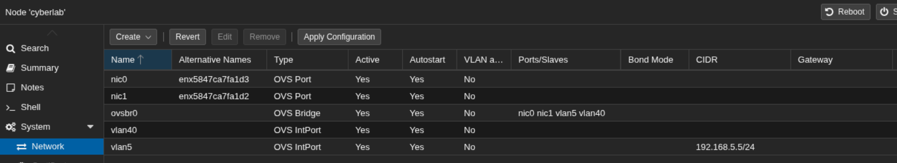

# cyberlab
Cyber lab on Proxmox

## Proxmox installation
1. [Download](https://www.proxmox.com/en/downloads/proxmox-virtual-environment/iso) the **Proxmox VE 9.2 ISO Installer** image (ie. `proxmox-ve_9.2-1.iso`)
2. [Copy it to a bootable thumb drive](https://pve.proxmox.com/pve-docs/chapter-pve-installation.html#_instructions_for_windows)
3. Boot the server to that drive to install Proxmox as the hypervisor
4. [Log in](https://pve.proxmox.com/pve-docs/chapter-pve-installation.html#_instructions_for_windows) to the Proxmox management interface


### Disable Proxmox Enterprise repository
1. Select the Proxmox host (ie. cyberlab)
2. In the **Updates** menu, select **Repositories**
3. Select the respository `https://enterprise.proxmox.com/debian/pve`
4. Click on **Disable**
5. Click **Add** and select the **No-Subscription** repository from the dropdown menu, then click **Add** again
6. Select the respository `https://enterprise.proxmox.com/debian/ceph-squid`
7. Click on **Disable**
8. Click **Add** and select the **Ceph Squid No-Subscription** repository from the dropdown menu, then click **Add** again

## Open vSwitch
By default, Proxmox will use Linux bridge for networking. This section will help you install and configure Open vSwitch, which is needed for more advanced networking features, just as port mirroring.

### Add Open vSwitch
Install openvswitch on the Proxmox host.

1. Right-click on the Proxmox host
2. Select **Shell**

```
apt update
apt install openvswitch-switch
```
### Configuring Open vSwitch
Switching from Linux bridge to Open vSwitch must be done carefully so you don't look network connectivity during the process. The high level process is as follows:

1. Create a new **OVS Bridge** (ie. `ovsbr0`)
2. Create a new **OVS IntPort** on the OVS bridge. Give it an IP address and mask (ie. `192.168.5.5/24`) and use **VLAN Tag** (ie. `5`)
3. Add the same **VLAN Tag** to a physical interface (ie. `nic1`) to add the interface to the VLAN

You should now be able to connect to that interface, so you can complete the rest of the OVS configuration.

Create another **OVS IntPort** for VLAN 40. You don't need to add an IP address and mask to it, so that it obtains its address via DHCP. Add the other interface (ie. `nic0`) to VLAN 40.

Be sure to click **Apply Configuration** when done making your chagnes in the UI.



Alternately, you can get to this point by setting your `/etc/network/interfaces` file with the content in the example [interfaces file](assets/ovs-config.txt)
```
# Reload Proxmox network config after changing interfaces file
ifreload -a
```


## Database server
Enable SSH on the VM and open the service in the firewall
```
# Enable SSH
sudo systemctl enable --now sshd

# Add the service to the firewall
sudo firewall-cmd --add-service=ssh --permanent
sudo firewall-cmd --reload
```
You can now SSH into the VM rather than working from the VM's console within Proxmox
```
# SSH to the IP address of the VM
ssh smerrow@192.168.86.43
```

Update packages on the VM, and install MariaDB. Then start it up and set it to start any time the VM boots up.

```
# Install MariaDB
sudo dnf upgrade --refresh -y
sudo dnf install mariadb-server -y

# Start the `mariadb` service and enable it to start at boot up
sudo systemctl enable --now mariadb

# Verify it is running
systemctl status mariadb
```
Execute the MariaDB security script to secure root access, drop default anonymous users, and remove test databases
```
sudo mariadb-secure-installation
```
Follow the interactive prompts:

> [!IMPORTANT]
> Use the answers below, not what is recommended by the script. 

- **Enter current password for root**: Press Enter (default is blank).
- **Switch to unix_socket authentication**: Y.
- **Change root password**: Y (set a strong administrative password).
- **Remove anonymous users**: Y.
- **Disallow root login remotely**: Y.
- **Remove test database and access to it**: Y.
- **Reload privilege tables now**: Y.

Create the Medical Application Database & User
```
# Log in as root
sudo mariadb -u root -p
```
Inside the MariaDB shell, create a dedicated database using utf8mb4 encoding (essential for handling complex medical records and international patient names) and a non-root application user. You can simply paste the following lines into the database prompt.
```
CREATE DATABASE patient_sim_db CHARACTER SET utf8mb4 COLLATE utf8mb4_unicode_ci;

CREATE USER 'med_app_user'@'localhost' IDENTIFIED BY 'cyberisfun';

GRANT ALL PRIVILEGES ON patient_sim_db.* TO 'med_app_user'@'localhost';

FLUSH PRIVILEGES;
EXIT;
```
Confirm that the new application user can log into the database without root privileges:
```
# Log into mariadb, and switch into the patient_sim_db database
mariadb -u med_app_user -p patient_sim_db

# If the prompt changed to the db name, then you can exit
exit
```

### Create database schema
To create the database schema, which includes all the tables, fields and data definitions, use the file [patients_schema.sql](assets/patients_schema.sql) and run the following command.
```
mariadb -u med_app_user -p patient_sim_db < patients_schema.sql
```

### Seed a single patient record
You can now add a single patient record into the database to verify if everything looks good. Use [sample_patient.sql](assets/sample_patient.sql) as follows:
```
mariadb -u med_app_user -p patient_sim_db < sample_patient.sql
```
View the tables and patient.
```
# Log into mariadb, and switch into the patient_sim_db database
mariadb -u med_app_user -p patient_sim_db
```
Enter the following commands at the database prompt. You should see the tables in the database, and the details of the `patients` table. You can then view the sample patient in the database.
```
-- List all created tables
SHOW TABLES;

-- Inspect the structure of a specific table
DESCRIBE patients;

-- View the sample patient
select * from patients;
```

### Seed 1000 sample patients
Use the [seed_patients.py](assets/seed_patients.py) Python script to seed 1000 patients into the database.

> [!IMPORTANT]
> Make sure you have the right password in the `seed_patients.py` file 
```
# Install pip
sudo dnf install -y python3-pip

# Install required packages
pip install faker mysql-connector-python

# Run the seed script
python seed_patients.py
```


